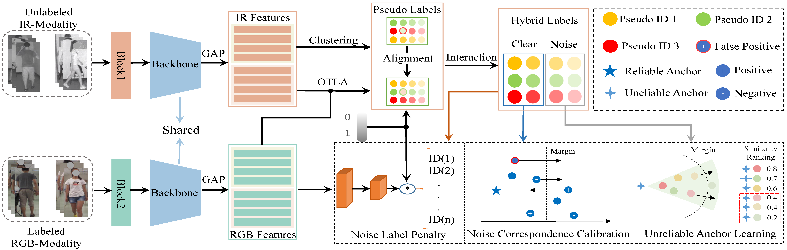

# Dual Pseudo-Labels Interactive Self-Training for Semi-Supervised Visible-Infrared Person Re-Identification ICCV2023 [Paper Link](https://openaccess.thecvf.com/content/ICCV2023/papers/Shi_Dual_Pseudo-Labels_Interactive_Self-Training_for_Semi-Supervised_Visible-Infrared_Person_Re-Identification_ICCV_2023_paper.pdf)

## Contribution
1. We propose a dual pseudo-label interactive self-training framework for semi-supervised visible-infrared person Re-ID, which leverages the intro- and inter-modality characteristics to obtain hybrid pseudo-labels.
2. We introduce three modules: noise label penalty (NLP), noise correspondence calibration (NCC), and unreliable anchor learning (UAL). These modules help to penalize noise labels, calibrate noisy correspondences, and exploit hard-to-discriminate features.
3. We provide comprehensive evaluations under these two semi-supervised VI-ReID. Extensive experiments on two popular VI-ReID benchmarks demonstrate that our DPIS achieves impressive performance.

## Framework


## Train
```
1. sh run\_train\_sysu.sh for SYSU-MM01
2. sh run\_train\_regdb.sh for RegDB
```
# Test
```
1. sh run\_test\_sysu.sh for SYSU-MM01
2. sh run\_test\_regdb.sh for RegDB
```

## Citation
If our work is helpful for your research, please consider citing:
```
@inproceedings{shi2023dual,
  title={Dual Pseudo-Labels Interactive Self-Training for Semi-Supervised Visible-Infrared Person Re-Identification},
  author={Shi, Jiangming and Zhang, Yachao and Yin, Xiangbo and Xie, Yuan and Zhang, Zhizhong and Fan, Jianping and Shi, Zhongchao and Qu, Yanyun},
  booktitle={Proceedings of the IEEE/CVF International Conference on Computer Vision},
  pages={11218--11228},
  year={2023}
}
```

## Contact
jiangming.shi@outlook.com; S_yinxb@163.com.

The code is implemented based on OTLA.

